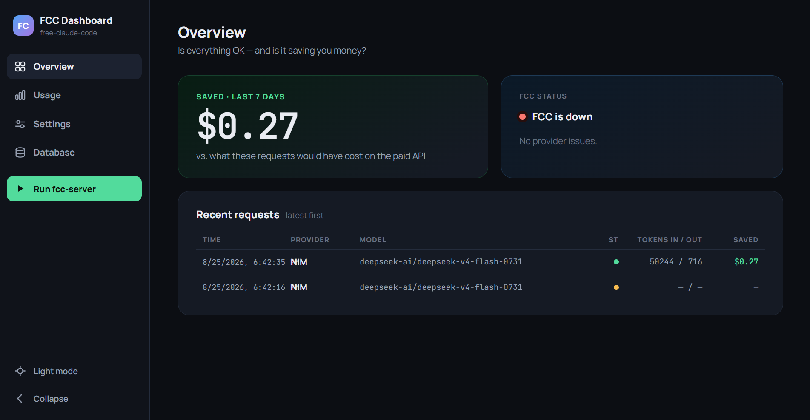

<p align="center">
  <h1 align="center">FCC Dashboard</h1>
  <p align="center"><b>See what your Claude Code proxy is actually doing.</b></p>
  <p align="center">A local, read-only monitoring dashboard for <a href="https://github.com/Alishahryar1/free-claude-code">free-claude-code</a> (FCC) — live status, request history, and real cost savings, in your browser.</p>
</p>

<p align="center">
  
  
  
  
  
  
  
  
  
</p>

---



## What this is

[free-claude-code](https://github.com/Alishahryar1/free-claude-code) (FCC) is a proxy that lets you run Claude Code while routing the actual model requests through cheaper or free third-party providers — NVIDIA NIM, OpenRouter, DeepSeek, local models via Ollama or LM Studio, and others — instead of paying Anthropic's own API prices.

**FCC Dashboard** is a separate, standalone tool that watches FCC and reports on it. It reads FCC's log file (read-only) and, for convenience, can start or stop the `fcc-server` process. It never modifies FCC or its installation. It exists to answer three questions:

- Is FCC actually running?
- What provider and model is it really routing my requests to?
- How much money is that saving me compared to hitting Anthropic directly?

FCC itself is not part of this repo — you need to install and configure it separately first. Development and testing has been done against **FCC v5.14.3**; other versions aren't guaranteed to work identically, since the log format this dashboard reads is tied to that version.

One rule holds across every page: **money numbers are never guessed.** If a provider+model pair has no configured price, its savings show as "unknown" — never silently $0, never assumed free.

The UI is dark/light theme aware and built with a small custom design system (no component library). It refreshes on its own: the backend polls FCC's log roughly every 5 seconds, and the frontend refetches from the backend roughly every 10 seconds — so new activity can take up to about 15 seconds to appear, not instantly.

## Prerequisites

- [FCC (free-claude-code)](https://github.com/Alishahryar1/free-claude-code) already installed and configured — this dashboard does not install or configure it.
- Python 3.11+
- [`uv`](https://docs.astral.sh/uv/)
- Node.js + npm

## Quick start (recommended)

Runs everything as a single process, serving both the API and the built UI from one port.

```bash
git clone https://github.com/FreddyZeta1847/fcc-dashboard.git
cd fcc-dashboard

# Backend
cd backend && uv sync && cd ..

# Frontend
cd frontend && npm install && npm run build && cd ..

# Start
cd backend && uv run fcc-dashboard-server
```

Open **http://127.0.0.1:8000**.

> If you rebuild the frontend while the backend is already running, restart the backend — it only checks for a frontend build once, at its own startup.

### Global `fcc-dashboard` command (optional)

For repeated local use, `npm link` (or `npm install -g .`, run from the repo root) once registers a `fcc-dashboard` global command that starts the single-process server from any directory — a shortcut for the quick start's final "start" step, not a replacement for it. It doesn't build the frontend or sync backend dependencies for you; run the steps above at least once first.

```bash
npm link      # from the repo root, once
fcc-dashboard # from anywhere, any time after
```

Uninstall with `npm uninstall -g fcc-dashboard`.

## Development mode

Runs the backend API and the Vite dev server separately, in two terminals. The Vite dev server proxies API calls to the backend, so both need to be running.

**Terminal 1** (from `backend/`):
```bash
uv run fcc-dashboard-server
```
Binds to `127.0.0.1:8000`.

**Terminal 2** (from `frontend/`):
```bash
npm run dev
```
Starts Vite on `127.0.0.1:5173`. Open that URL during development — not the backend's port.

## Getting FCC's log data to show up

FCC only writes the detailed per-request data this dashboard needs when FCC's own `LOG_LEVEL` (set in **FCC's** `.env` file, not this dashboard's) is `DEBUG`. At FCC's default `INFO` level, the dashboard will run without errors but show no request data at all. If the Overview page looks empty, check this first.

## Configuration

All settings are environment variables, all optional — sensible defaults are used if unset.

| Variable | Default | What it is |
|---|---|---|
| `FCC_DASHBOARD_DB_PATH` | `~/.fcc-dashboard/fcc_dashboard.db` | This dashboard's own SQLite database (collected history). |
| `FCC_DASHBOARD_PRICING_PATH` | `~/.fcc-dashboard/pricing.json` | This dashboard's editable pricing/cost config. |
| `FCC_LOG_PATH` | `~/.fcc/logs/server.log` | FCC's own log file — FCC's data, not this dashboard's, read-only. |
| `FCC_DASHBOARD_STATIC_DIR` | `frontend/dist` (relative to repo root) | Where the backend looks for the built frontend in single-process mode. |

## Tech stack

**Backend** — Python 3.11+, FastAPI, uvicorn, stdlib `sqlite3` (no ORM), `httpx` for outbound calls, `psutil` for process management, `uv` for dependency management. 164 tests, run with pytest.

**Frontend** — React 19 + TypeScript, Vite 8, TanStack Query for data fetching, plain CSS custom properties for theming, npm for dependency management. 57 tests, run with Vitest + Testing Library.

## Security

The backend binds to `127.0.0.1` only — hardcoded in `serve()` in `backend/src/fcc_dashboard/__main__.py`, not just a convention. The API is never reachable from the network, regardless of how it's started.

## Process control

Starting FCC from the dashboard launches it fully detached: it keeps running even after you close the dashboard. Use the dashboard's own Stop control (or your OS's process tools) to stop it.

On Windows, stopping FCC through the dashboard is always a hard kill — there's no graceful shutdown.

## Status

This is a personal utility for monitoring your own local FCC setup — not a hosted service, and there's no multi-user or account system.
